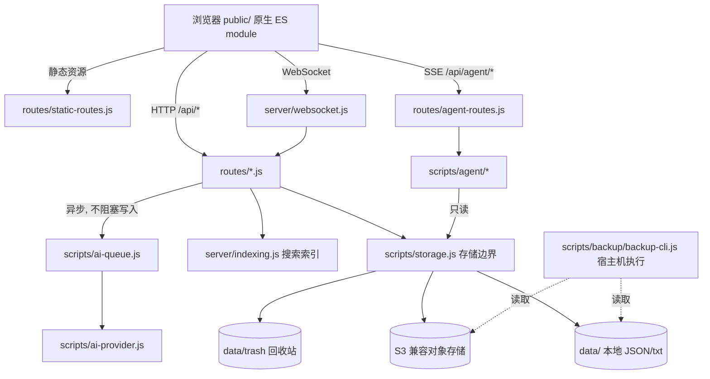

# DumbPad 系统架构全景

> 本文只写"看代码看不出来"的边界与约束。函数级细节、逐文件说明一律不写，避免腐烂。
> 模块级实现细节见 [docs/technical-overview.md](docs/technical-overview.md)，该文档由代码事实驱动，比本文更新更频繁。

## 1. 系统全景

无构建步骤的单体 Node 服务：浏览器直接加载原生 ES module，服务端一个 Express 进程同时提供 HTTP API、静态资源和 WebSocket。

关键结构约束：**前端永远不直连 S3**。所有云端读写都经由 `scripts/storage.js` 之后的后端 API。

## 2. 模块划分与依赖边界

| 层 | 位置 | 职责 | 硬约束 |
| :-- | :-- | :-- | :-- |
| 前端视图 | `public/` | UI 渲染、手势、本地缓存、离线 outbox | 不持有 S3/AI 凭据，不绕过 `storage` 边界 |
| HTTP 路由 | `routes/*.js` | 参数校验、HTTP 状态、广播副作用 | 不拼本地路径、不拼 S3 key；持久化只调 `scripts/storage.js` |
| 后端入口 | `server.js` | 中间件、route 注册、WebSocket 挂载 | 只注册，不承载业务逻辑 |
| 领域服务 | `scripts/` | 存储、AI、备份、安全、资产策略 | `scripts/agent/*` 与 `scripts/ai-queue.js` 是两条独立运行线 |
| 存储边界 | `scripts/storage.js` | 唯一的用户数据读写出口 | 上层不感知 local/S3、legacy/split layout |
| 运行时数据 | `data/` | Notepad/Thought/资产/索引/回收站 | 已 gitignore，任何代码不得假设其结构稳定 |

### 两条 AI 运行线必须隔离

- **后台管线** `scripts/ai-queue.js` + `scripts/ai-provider.js`：Thought 创建后异步生成 meta/embedding/relations，写回 storage 并通过 WebSocket 广播。
- **交互 Agent** `scripts/agent/*`：用户手动触发的只读 `recall_context`，走 SSE，独立 `AI_AGENT_*` 配置。

二者**不得互相调用**：Agent 不复用后台队列，后台队列不写入 AgentRun。任一方失败都不能阻塞 Thought/Notepad 保存。

### 三个"用完即走/短生命周期"域互不串线

- **Today Drafts**（`routes/today-drafts-routes.js` + `public/managers/today-drafts/`）：按服务端日期清理的单行清单，独立写锁 + 独立 `today_drafts_update` 事件。
- **Trash**（`routes/trash-routes.js`）：回收站只经 storage 边界。
- **AgentRun**（`scripts/agent/agent-run-service.js`）：运行记录，不参与搜索与关系。

这三个域都**不进入** Thought 的 AI、标签、关系流程，也不应被搜索索引吸收。

## 3. 关键数据流向

**Thought 快速写入（必须保持"不等待"）**
`用户操作 → ThoughtsManager 乐观更新 → ThoughtApiClient → 失败则 ThoughtOutbox 落 localStorage → 服务端写入成功后 ai-queue 异步补 meta/relation → WebSocket 推状态`

任何把 AI、S3 同步、关系计算塞进这条同步路径的改动都是回归。

**Notepad 编辑**
`app.js → note-sync-controller 启动缓存（先渲染本地，后台校验远端版本）→ note-routes → storage.writeNoteContent（临时文件 + rename 原子写）→ WebSocket notes_update`

**分页与搜索**
`GET /api/thoughts?format=page&light=1&sort=timeline` 在 `STORAGE_LAYOUT=split` 下走 `indexes/thoughts-index.json` 完成筛选排序，只读当前页对象；索引缺失、`legacy` 布局或**任意关键词全文搜索**时回退完整读取。回退是正确性要求，不能以不完整结果冒充搜索结果。

**备份（宿主机侧，不在应用容器内）**
`systemd timer → scripts/backup/backup-cli.js snapshot → 去重加密仓库 → 自动追加 health 校验`。S3 源 Adapter 只暴露读能力；运行桶与备份桶、两套凭证相同都会被写路径拒绝。

## 4. 核心抽象与设计约束

- **单一存储边界**：`scripts/storage.js` 暴露 Notepad/Thought/Today Draft/Trash/AI meta/relations/indexes 的统一方法集，并持有 `withThoughtWriteLock()` 异步互斥锁，Thought 的读-改-写必须整体包在锁内。
- **乐观并发**：Notepad/Thought/Today Draft 都用 `baseVersion`；冲突返回 `409`，前端必须可恢复，不能死锁。
- **本地优先 + 离线 outbox**：Thought 与 Today Draft 在浏览器侧各有 outbox（`localStorage`），联网后按 id 回放。
- **写锁分级**：Thought 一把锁，Today Draft 一把独立锁，互不阻塞。
- **破坏性操作默认关闭**：`DUMBPAD_ENABLE_DESTRUCTIVE_DATA_OPERATIONS=false` 是默认值，空间删除、本地覆盖 S3、S3 覆盖本地、非 dry-run 本地导入都会被拒。
- **`S3_PREFIX` 是数据集隔离边界**：测试 / 真实 / 备份必须用不同 prefix。
- **鉴权双轨**：Legacy PIN 与 Personal security V1（`AUTH_V2_ENABLED=true`）并存。V2 启用后旧 PIN Cookie 与 PIN Bearer 全部失效，API token 只带 `content:*` / `thoughts:*` scope，不能调用 `/api/auth/*` 和 `/api/data-management/*`。
- **Cookie 用 `SameSite=Lax` 而非 Strict**：已安装 PWA 冷启动在部分移动端浏览器没有 same-site initiator，Strict 会丢 Cookie，导致每次完全退出都要重输 PIN/密码。

## 5. 外部依赖与集成点

| 集成点 | 接入位置 | 降级行为 |
| :-- | :-- | :-- |
| S3 兼容对象存储 | `scripts/s3-service.js` | 无；后端必需或退回 local |
| OpenAI-compatible chat / embedding / rerank | `scripts/ai-provider.js` | 无 key 时 noop provider，核心保存不受影响 |
| 交互 Agent 模型 | `scripts/agent/agent-model-client.js` | 默认 `AI_AGENT_ENABLED=false` |
| 备份桶 | `scripts/backup/s3-backup-repository.js` | 无参数时只跑只读 `health` |
| Vditor / Lute（编辑器） | `public/hybrid-editor.js` | 延迟加载，不占首屏关键路径 |
| Marked + 扩展 | `server.js` 与前端共用 | — |
| Fuse.js（搜索） | `server/indexing.js` | 数据源来自 `storage.getSearchDocuments()` |

## 6. 技术债务与已知取舍

- **`server.js` 仍是约 28KB 的入口 + 注册中心**：已拆出 13 个 route 模块，但 Notepad 部分业务与中间件编排仍留在其中。继续拆的前提是保持 URL、HTTP 状态、响应体和 WebSocket 副作用完全不变。
- **前端无构建步骤**：新增 `public/` 下的模块必须确认 service worker 的 asset manifest 能覆盖到，否则 PWA 离线会 404。
- **无 hash 的静态资源走 network-first**：因为版本未内容哈希化，cache-first 会让普通刷新拿到旧样式/旧模块。回退窗口（导航 600ms / 静态 450ms）由 `test/test_pwa_cache_regression.js` 固化。要改缓存策略，必须先接受这个回归测试会红。
- **编辑器 Enter 行为是行为基线，不是实现细节**：`handleWysiwygSoftEnter()` 只在顶层普通段落拦截。基线分支是 `refactor-ai-s3-thoughts`，`main` 与之**不等价**，排查时不能用 `main` 替代基线。
- **Thought 分页游标不可混用**：`sort=timeline` 是页面专用排序（置顶 + 完成状态 + 创建时间），默认分页按 `updatedAt`，两者游标语义不同。
- **`legacy` 布局的 `thoughts.json` 是单文件全量读写**：数据量大时是性能瓶颈，迁移到 `STORAGE_LAYOUT=split` 才能真正利用索引分页。
- **备份 CLI 不自动加载项目 `.env`**：避免把运行桶凭证带进备份写路径；因此每次必须显式传参或依赖 root-only 的 `/etc/dumbpad/backup.env`。
