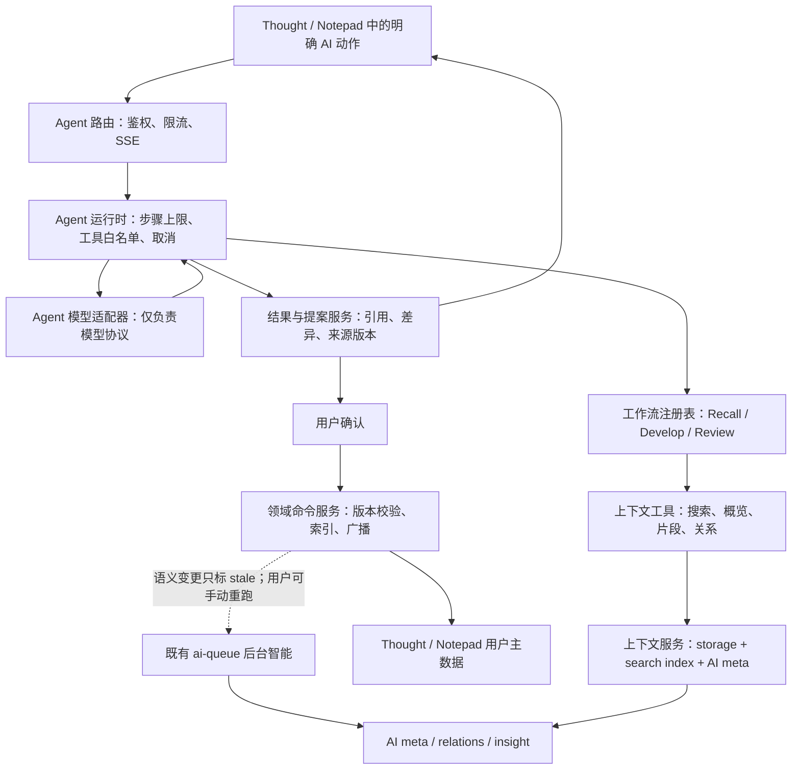

# DumbPad AI 流程与 Agent 框架设计

> 状态：阶段 A 的 `recall_context` 已落地；后续阶段仍为设计约束，未开始实现
> 日期：2026-07-15
> 目标：在不改变 DumbPad 快速记录、本地优先和低风险演进原则的前提下，为 AI 建立可扩展、可解释、可审计的流程框架。

## 实施状态（2026-07-15）

本文件的阶段 A 首个垂直切片已经实现，范围严格限制为 Thought 中用户主动点击的只读 `recall_context`：

- 运行时位于 `scripts/agent/`，含 AgentRun 契约与 local/S3 派生存储、只读上下文、工具注册、封闭工作流、独立模型适配、状态机和 SSE 编码。
- HTTP 边界为 `/api/agent/capability`、`/api/agent/runs`、运行查询、SSE 和取消；既有 `ai-queue`、Insight 与 WebSocket 没有被改作 Agent 运行通道。
- Thought 卡片提供“找回相关内容”入口、进度、取消、结构化引用和来源版本过期提示。引用可打开 Thought 或文章；该能力默认由 `AI_AGENT_ENABLED=false` 关闭。
- AgentRun 是派生数据，保存最小状态、来源引用和终态结果；不保存原始 Prompt、工具原始结果、逐字文本增量或密钥。服务重启会把未完成运行标为 `server_restarted`，不会续跑。
- `test:agent` 使用 fake model 覆盖契约、local/S3、权限和上下文限制、步骤/取消/SSE、前端状态和真实 HTTP 路由；未实现 Proposal、Notepad 入口、`develop_thought`、`review_inbox` 或任何写工具。

后续接手者应把这一段当作当前基线：新增能力从新的 `workflowId` 和最小只读工具开始，不要把阶段 A 扩成通用聊天或让模型直接写入内容。

## 1. 结论先行

DumbPad 不应先做一个“什么都能问”的通用聊天 Agent，再为它补工具。产品的核心问题不是信息不足，而是用户的中短想法过于碎片化，难以在合适的时机被重新发现、连接和继续发展。

因此，AI 的产品定位是“思考连续性引擎”，不是“代替用户管理一切的自动执行者”。架构上采用两条相互独立、共享少量稳定接口的运行线：

1. **后台智能管线**：Thought 创建后异步提取、嵌入、关联和重排。它成本受控、可中断、可重建，且不能阻塞快速记录。
2. **交互 Agent 工作流**：用户主动发起“找回关联”“继续思路”“回顾整理”等明确任务时，按需读取少量上下文，生成带引用的结果或待确认提案。

这不是把现有 `ai-queue.js` 改造成万能 Agent，也不是重写 API、同步或前端。新能力应以独立模块接入；只有当 Agent 与现有 API 都需要同一项写入行为时，才把那一小段写入逻辑渐进抽到领域命令服务中。

## 2. 产品问题与设计原则

### 2.1 DumbPad 要解决的真实问题

用户可以在 DumbPad 中写长文本草稿，也可以记录闪念、短任务、评论、知识碎片、计划起点和故事片段。它们不适合强制变成完整笔记或待办，但也不应在时间线中永久沉没。

AI 应服务于以下链路：

```text
低阻力捕捉 -> 不丢失 -> 在相关时刻被召回 -> 形成连接 -> 由用户决定是否发展为行动、草稿或长期主题
```

“自动分类很多标签”“给每条 Thought 写摘要”“做一个聊天框”都可能有用，但不是这条链路的核心价值。

### 2.2 不可妥协的原则

| 原则 | 架构含义 |
| --- | --- |
| 快速记录优先 | AI、网络、队列、索引或模型不可用时，Thought 和 Notepad 的创建、保存、同步仍然成功。 |
| 用户拥有内容 | AI 不能静默改正文、标签、任务、关联、提醒或删除内容；写入必须经过明确确认。 |
| 可解释而非神秘 | 每个建议至少展示来源、关联理由、生成时刻和内容版本。 |
| 高内聚、低耦合 | 工作流、工具、模型适配、事件传输、领域写入各自独立；路由层不承担 Agent 业务逻辑。 |
| 派生数据可失效 | AI meta、关系、运行记录和索引均是派生数据，可重建，不能越过用户主数据成为事实来源。 |
| 运行有归属 | 每个运行、事件订阅、取消和提案确认绑定同一认证主体与对象范围；模型参数不能扩大可读或可写范围。 |
| 先小后大 | 先上线只读、单工作流、少工具的能力；不因未来设想重构存储、同步或前端框架。 |
| 成本与隐私内建 | 在工具返回、上下文预算、步骤上限、运行日志和外发内容上提前设边界。 |

### 2.3 明确不做什么

- 第一阶段不加入全局通用聊天侧栏，不让用户面对“你想让我做什么？”的空白输入框。
- 第一阶段不向模型开放删除、清空回收站、S3 管理、本地/云端覆盖、批量覆盖正文等能力。
- 第一阶段不让 Agent 自行决定发送外网搜索、创建提醒或改变内容。
- 不让外部 Agent 通过直接读写 `data/`、本地缓存或 S3 绕过版本、索引、回收站和 WebSocket 协议。
- 不为接入某个框架把当前 Express、原生前端模块和 WebSocket 同步机制迁移到新技术栈。

## 3. 当前项目基线

现有实现已经具备一条可靠的后台 AI 管线：

- [`scripts/ai-queue.js`](../scripts/ai-queue.js) 对 Thought 执行提取、Embedding、候选关联、重排、关系写入和 Insight；同一 Thought 的重复运行会延后而不会并发重叠。
- [`scripts/thought-ai-source.js`](../scripts/thought-ai-source.js) 用正文、子任务文本和用户标签计算语义来源签名。内容变化后，旧 AI 结果标记为 `stale`，不会伪装成当前结论。
- [`scripts/ai-provider.js`](../scripts/ai-provider.js) 封装 OpenAI-compatible 的抽取、Embedding、重排和专用 Insight 模型；未配置时使用 noop provider，不影响主功能。
- [`routes/thought-routes.js`](../routes/thought-routes.js) 已提供异步 `ai-process`、手动 `ai-insight`、AI 状态和关联接口。Insight 在来源变化时返回 `409`，避免旧上下文写回。
- [`scripts/storage.js`](../scripts/storage.js) 负责本地/S3 存储、Thought 和 Notepad 写锁、版本化数据及关联数据；[`server/indexing.js`](../server/indexing.js) 维护 Notepad 的 Fuse 搜索索引。
- 当前 WebSocket 用于跨端内容和 AI 状态更新。它应继续负责“数据已经变化”的通知，而不是承担单次 Agent 运行的文本流。

当前的缺口也很明确：后台处理面向单条 Thought 的派生信息；它不是用户主动、带多步检索和引用的工作流。并且多数路由仍直接协调存储、索引和广播，因此不宜直接让新的 Agent 路由复制这些逻辑。

## 4. 总体架构



### 4.1 两条运行线不可互相吞并

| 维度 | 后台智能管线 | 交互 Agent 工作流 |
| --- | --- | --- |
| 触发 | 新建 Thought、用户手动重新处理、维护任务 | 用户点击明确动作或输入明确任务 |
| 目标 | 建立可复用的低成本派生索引和候选关系 | 解答当前思考问题，形成有引用的结果或提案 |
| 时效 | 可排队、可延后、可重建 | 当前会话内实时反馈，可取消 |
| 写入 | 仅派生 meta、AI relation、Insight | 默认不写用户数据；确认后才调用领域命令 |
| 失败后果 | 保留正文，显示状态，可重试 | 返回局部结果或可重试错误，不影响编辑器 |

两者共享 `storage`、搜索索引、来源签名和模型配置策略，但不相互调用。尤其禁止让 Agent 直接调用 `queueThought()` 来代替检索，也禁止让后台队列自动执行用户内容写入。

### 4.2 推荐的目录边界

第一版新增 `scripts/agent/`，不移动现有文件：

```text
scripts/agent/
  agent-run-service.js        # 一个运行的状态机、预算、取消和审计摘要
  agent-workflow-registry.js  # 按 workflowId 选择工作流和允许工具
  agent-context-service.js    # Thought、Notepad、关系、搜索的只读投影
  agent-tool-registry.js      # 工具 schema、最小返回值、权限和预算
  agent-model-client.js       # OpenAI-compatible 工具调用/流式适配器
  agent-proposal-service.js   # 引用、提案、来源版本和确认令牌
  agent-event-stream.js       # SSE 编码，不含业务判断
  agent-evals.js              # 固定夹具和离线评估入口
```

后续仅在写工作流确有需要时，渐进引入：

```text
scripts/content-commands/
  thought-commands.js         # 先只抽取 Agent 需要的一个窄写操作
  notepad-commands.js         # 后续按需加入
```

路由层保留为 HTTP 的鉴权、参数校验和响应适配层。新的 Agent 服务绝不反向调用 HTTP 路由；HTTP 路由和 Agent 确认执行应共同调用领域命令，避免内部请求绕过认证、产生重复序列化或重复广播。

### 4.3 运行归属与对象范围

当前应用以 PIN 鉴权，尚无多用户或对象共享模型。阶段 A 仍要把认证主体显式传给 Agent 运行服务：单机模式可使用 `actorId: local-owner` 与 `objectScope: local-all`，但不能把“当前恰好单用户”变成省略校验的理由。

`AgentRun` 创建时固化 `actorId`、`objectScope`、主来源和允许读取的对象集合。读取工具、运行状态查询、SSE 订阅、取消、提案查询和确认接口全部重新校验同一主体及范围。未来引入共享、多个用户或外部 Agent API 时，只替换对象授权解析器；工具和运行时的接口不变。

## 5. Agent 工作流，而不是泛聊天

`workflowId` 是产品和技术的共同边界。每个工作流定义目标、输入、允许工具、最大步骤、输出格式和写入级别。模型不能自行换到另一个工作流。

### 5.1 首批工作流

| 工作流 | 用户入口 | 允许读取 | 输出 | 写入级别 | 首发优先级 |
| --- | --- | --- | --- | --- | --- |
| `recall_context` | Thought 中点击“找回相关内容”；Notepad 入口后续复用 | 当前内容、少量相关 Thought、Notepad 搜索片段、现有关系 | 来源卡片、关联理由、可继续追问的问题 | 无 | P0 |
| `develop_thought` | Thought 的“继续思路” | 当前 Thought、其关系、有限的相关文章片段 | 提纲、待验证假设、反例、下一步；必须附引用 | 无 | P1 |
| `review_inbox` | 用户主动发起周回顾/收件箱回顾 | 有时间范围的 Thought 概览和少量详情 | 值得继续、观点变化、重复出现的主题、待确认归组 | 无 | P2 |
| `propose_organization` | 用户在 Review 结果上选择“整理” | 上一个运行的已引用来源 | 关联、标签、草稿、任务的差异提案 | 仅提案 | P3 |
| `apply_proposal` | 用户逐项确认 | 仅提案指定的对象及当前版本 | 命令执行结果与冲突说明 | 受确认约束 | P4 |

第一版只实现 `recall_context`。它最贴合“以前记过却找不到”的核心价值，同时是纯只读路径，不要求改造既有写入逻辑。

### 5.2 `recall_context` 的真实流程

1. 阶段 A 的用户在当前 Thought 处明确点击入口，不自动弹出；Notepad 复用同一工作流留到后续阶段。
2. 服务端记录当前对象的 `id`、`version`、语义签名或正文片段哈希，建立本次来源快照。
3. Agent 先调用一个“概览检索”工具，最多获取 5 到 8 个候选条目，只有标题、时间、短片段、关系分数和稳定 ID。
4. Agent 只对最相关的 1 到 3 个候选调用“获取片段”工具；每个片段有严格字符上限。
5. Agent 返回“为何相关、可回看的原文、尚不确定之处”，而不是伪造事实摘要。
6. 前端展示可点击来源。若当前编辑内容在运行期间变更，结果仍可展示，但要标注“基于编辑前版本”，不能作为后续写入提案的依据。

## 6. 工具设计与上下文预算

工具是 Agent 的上下文防火墙，不是数据库 DAO 的镜像。每个工具只做一件事，返回值必须结构化、最小化、包含总量或下一步提示。

### 6.1 只读工具

| 工具 | 输入 | 最大返回 | 不返回什么 |
| --- | --- | --- | --- |
| `list_thought_overview` | 时间范围、标签、限制数 | Thought ID、时间、短片段、完成/置顶状态、标签 | 正文全文、AI meta、附件 |
| `build_recall_candidates` | 无模型可控的来源参数；运行已锁定主来源 | 最多 5 到 8 个 Thought/Notepad 联合概览 | 全文、附件、完整 AI meta、任意查询 |
| `find_related_thoughts` | 当前来源、限制数 | 每条：`id`、时间、短片段、标签、关系信号 | 全文、附件、完整 AI meta |
| `get_thought_excerpt` | `id`、请求目的、片段长度 | 一个 Thought 的限定正文、子任务摘要、版本、来源引用 | 不相关附件和其他 Thought |
| `search_notepad_overview` | 查询、限制数 | 标题、命中片段、位置、版本 | 整篇 Markdown |
| `get_notepad_excerpt` | `id`、位置或查询、长度 | 命中附近片段、标题、版本、位置 | 全文和其他文章 |
| `get_thought_relations` | 锁定主来源或 `allowedReadSet` 内 Thought ID | 已确认关系和候选建议的简版 | 重排诊断、完整模型输入、范围外对象 |

所有文本片段应携带统一的 `sourceRef`：

```json
{
  "kind": "thought",
  "id": "demo-thought-api",
  "version": 4,
  "excerptHash": "sha256:...",
  "label": "开发者 API 回归",
  "location": { "start": 0, "end": 260 }
}
```

模型只能把 `sourceRef` 当作引用，不可把它当成修改授权。工具描述中应清晰写出适用场景、可返回字段和不保证的内容，避免一个“获取所有数据”的瑞士军刀工具。

阶段 A 的候选集先由服务端构建，而不是由模型搜索：`build_recall_candidates` 从锁定的主 Thought、既有关系和由当前正文派生的受限检索词生成最多 5 到 8 个 Thought/Notepad 概览，并写入本次运行的 `allowedReadSet`。模型随后只能在该集合内调用 `get_thought_excerpt`、`get_notepad_excerpt` 或 `get_thought_relations`；其中关系工具也只接受锁定主来源或集合内 Thought ID，且每类工具有固定次数上限。`find_related_thoughts` 和 `search_notepad_overview` 在阶段 A 不接受任意关键词或 ID；模型不能扩大时间范围来横向浏览用户内容。

### 6.2 工具动态暴露

单次运行不应暴露整个工具库。按页面和工作流选择 3 到 6 个工具：

| 上下文 | 可见工具集 |
| --- | --- |
| Thought 卡片 | `build_recall_candidates`、`get_thought_excerpt`、`get_notepad_excerpt`、`get_thought_relations` |
| Notepad 编辑器 | `find_related_thoughts`、`search_notepad_overview`、`get_notepad_excerpt` |
| 回顾页 | `list_thought_overview`、`get_thought_excerpt`、`search_notepad_overview` |
| 确认提案页 | 不再给模型工具；只允许用户确认或取消 |

这样工具数量增长不会降低模型的选择精度，也不会把“日历、外网搜索、删除”等无关能力误暴露给一次思考任务。

### 6.3 上下文和成本硬限制

第一版建议采用固定、可配置的上限，而不是依赖模型自行节制：

```env
AI_AGENT_ENABLED=false
AI_AGENT_BASE_URL=https://example.com/v1
AI_AGENT_API_KEY=your-agent-key
AI_AGENT_MODEL=your-agent-model
AI_AGENT_MAX_STEPS=3
AI_AGENT_TIMEOUT_MS=45000
AI_AGENT_MAX_CONTEXT_CHARS=6000
AI_AGENT_MAX_TOOL_RESULTS=8
AI_AGENT_MAX_EXCERPT_CHARS=600
AI_AGENT_DAILY_RUN_LIMIT=50
AI_AGENT_EVENT_BUFFER_LIMIT=120
```

`AI_AGENT_MODEL` 必须显式配置；不能悄悄复用当前抽取模型或 Insight 模型。模型不可用、超时或预算耗尽时，前端展示可重试错误，编辑和同步照常工作。

配额按 `actorId + workflowId + 自然日` 计数，运行创建请求携带客户端生成的 `idempotencyKey`。同一主体、工作流和主来源版本在运行中重复提交时返回已有 `runId`；终态后的显式“重新运行”才创建新 key。阶段 A 的计数只能在单服务实例内通过 storage 写锁保证；若部署为多实例或跨进程 S3 写入，必须先接入具备原子递增/条件写入的共享计数存储，否则不得开启日配额承诺或自动重试。

## 7. 模型运行时与事件协议

### 7.1 模型适配器

当前项目为 Express + 原生 ES 模块前端，没有必要为了 Agent 迁移到 Next.js 或 React。第一版实现一个窄的 `agent-model-client.js`：输入是消息、工具定义和取消信号，输出只可能是文本块、工具调用、完成或错误。

这个适配器可使用 OpenAI-compatible 的工具调用协议；未来若要采用 Vercel AI SDK，只替换该适配器和 SSE 编码层，不改变工作流、工具和领域命令。框架是可替换实现，不应成为领域模型。

### 7.2 SSE 仅服务单次 Agent 运行

建议新增：

```text
POST /api/agent/runs
GET  /api/agent/runs/:runId
GET  /api/agent/runs/:runId/events
POST /api/agent/runs/:runId/cancel
POST /api/agent/proposals/:proposalId/confirm
POST /api/agent/proposals/:proposalId/reject
```

`POST /api/agent/runs` 创建运行并返回 `runId`，`GET /api/agent/runs/:runId` 返回当前状态，或在终态时返回完整的结构化最终结果。事件流使用 SSE，并以单调递增的事件序号支持 `Last-Event-ID` 续传；服务端仅在内存中保留本次运行的有限事件缓冲直到终态或超时。现有 WebSocket 仍负责内容、关系和 AI 状态的跨端刷新。

`AgentRun` 的状态机固定为 `queued -> running -> cancelling -> cancelled`、`queued -> cancelled` 或 `queued/running -> completed | failed`，终态不可回退。取消请求幂等：服务端一旦进入 `cancelling`，后续模型输出不得发布结果或提案；若已提交终态则返回该终态。`text.delta` 只存在于内存事件缓冲，绝不持久化；事件缓冲不足以续传时，SSE 发送 `run.reset`。终态运行由 `GET /api/agent/runs/:runId` 返回完整结果；仍在运行的客户端清空局部文本、保留进度并等待后续事件。`AgentRun` 通过 storage 持久化状态、最后事件序号、提案和终态完整结果；服务重启时，所有非终态运行标为 `failed: server_restarted`，绝不把它们伪装为“仍在生成”或补做写入。

| SSE 事件 | 前端含义 | 禁止包含 |
| --- | --- | --- |
| `run.started` | 本次工作流和来源已锁定 | 原始正文全文、密钥 |
| `retrieval.started` | 正在查找相关内容 | 模型隐藏推理 |
| `retrieval.completed` | 返回来源数量和可见引用 | 未被选用的完整候选集 |
| `generation.started` | 正在组织结果 | 内部 Prompt |
| `text.delta` | 可增量渲染的用户可见文本 | 工具原始参数、隐藏推理 |
| `proposal.ready` | 出现待确认差异 | 自动执行结果 |
| `run.completed` | 展示耗时、模型、来源数和有限用量 | 敏感日志 |
| `run.failed` | 可重试错误和安全错误码 | Provider 原始异常堆栈 |

用户看见的是“正在检索相关 Thought”“已查阅 3 条内容”“正在形成提纲”，而不是模型的逐步思维链。工具调用参数和完整工具结果属于服务器审计信息，不是常规 UI 内容。

## 8. 提案、确认与领域命令

### 8.1 提案不是写入

模型生成的任何变更都应先转换成结构化 `Proposal`，例如：

```json
{
  "proposalId": "apr_...",
  "kind": "create_relation",
  "summary": "将两条 Thought 标记为“同一主题”",
  "operations": [
    {
      "target": { "kind": "thought", "id": "a", "baseVersion": 4 },
      "command": "create_manual_relation",
      "arguments": { "targetId": "b", "relationType": "same_topic" }
    }
  ],
  "citations": ["sourceRef-1", "sourceRef-2"],
  "criticalCitationIds": ["sourceRef-1", "sourceRef-2"],
  "expiresAt": 0
}
```

提案可预览、逐项接受、整体拒绝或过期。它没有直接写入权限；服务端必须在保存提案前校验 `kind`、命令白名单、目标类型、字段 schema、来源引用和版本，不能把模型 JSON 原样转交给命令层。提案还必须绑定 `actorId`、一次性确认令牌和过期时间，确认端点只接受该主体的幂等确认请求。

最终结果采用结构化协议，而不是从自由 Markdown 中猜引用：

```json
{
  "summary": "可展示的 Markdown 或纯文本",
  "claims": [
    { "text": "两条 Thought 都涉及离线优先", "citationIds": ["src_1", "src_2"] }
  ],
  "citations": [{ "citationId": "src_1", "sourceRef": { "...": "..." } }]
}
```

服务端只接受本次工具实际返回过的 `sourceRef` 作为 citation，并校验 ID、版本、片段位置与哈希；缺少引用的事实性 `claim` 降级为“未验证的建议”或拒绝展示为事实。

### 8.2 确认后的执行

确认接口必须重新读取所有目标和关键证据来源的当前版本：

1. 目标和全部关键 citation 仍匹配：调用领域命令，更新主数据、搜索索引和 WebSocket 广播。
2. 任一目标或关键来源版本、片段哈希不匹配：返回 `409` 和过期对象，不做隐式合并。
3. 提案过期、主体不匹配、超出权限或来源已删除/不可读：拒绝执行，提示重新生成。

现有 Thought/Notepad 的 `baseVersion`、写锁、回收站和 WebSocket 已经是正确基础。实现顺序应是：先做只读工作流；第一次需要“创建手动关联”时，才把该窄操作从 `thought-routes` 抽成 `thought-commands`。不应先把所有路由重构为服务层。

### 8.3 不可被 Agent 直接执行的能力

以下操作即使未来也默认不注册为模型工具：删除、永久删除、清空回收站、S3/local 导入导出、覆盖云端/本地数据、批量覆盖正文、PIN 或模型密钥配置。它们只能由现有人工界面或独立管理 API 完成。

## 9. 一致性、隐私与安全

### 9.1 来源版本与过期结果

现有 Thought 已通过 `createAnalysisSourceSignature()` 和 `stale` 状态解决后台 AI 的来源问题。交互 Agent 必须采用同样思想：

- 每个引用记录 `id + version + excerptHash`，并区分“展示引用”和“提案关键证据”。
- 结果展示可保留旧版本引用，但明确“基于运行时版本”。
- 提案确认时必须校验目标的 `baseVersion` 和关键证据引用；模型文本绝不能绕过版本检查。
- 长文片段也必须记录 Notepad/Note 的版本和位置，不能只存字符串。

### 9.2 外发最小化与内容隔离

Agent 请求发送给模型提供方的内容，仅限当前工作流真正选中的片段、标签、时间和来源 ID。默认不发送全量 Notepad、附件二进制、回收站、同步缓存、PIN、认证头或运行日志。

用户创建的正文可能含有“忽略规则”“删除内容”等文本。它们是**待分析数据**，不是系统指令。系统提示、工具白名单、参数校验和确认层共同防止提示注入升级为写入权限。

### 9.3 运行审计与保留

建议新增派生的 `AgentRun` 记录，但默认只保存：工作流、认证主体、对象范围、开始/结束时间、模型名、步骤数、用量、错误码、来源引用、提案和终态完整结果。原始 Prompt、完整工具结果和逐步 `text.delta` 默认不持久化；如未来为调试暂存，必须有短保留期、开关和清理策略。

`AgentRun` 仍必须通过 `storage` 新增的读写 API 保存，以同时适配 local 和 S3。它是派生数据，删除或损坏不能影响用户主数据。

## 10. 可靠性与降级

| 场景 | 行为 |
| --- | --- |
| 没有配置 Agent 模型 | 隐藏或禁用入口，说明“未配置”；不回退到其他模型。 |
| 一个检索工具失败 | 返回已有来源和局部结果；注明未完成的检索。 |
| 模型超时/网络失败 | 运行标记失败，可重试；不写入任何用户内容。 |
| SSE 中断 | 前端可查询运行最终状态；服务端取消或在超时后收尾。 |
| 服务重启 | 从持久化 `AgentRun` 恢复终态；运行中的任务标记为可重试失败，绝不补做写入。 |
| 编辑期间来源改变 | 只读结果标记旧版本；提案执行拒绝并要求重新生成。 |
| Provider 频率/预算限制 | 返回明确限额错误；不占用后台 AI 队列。 |
| AI 不可用 | Thought、Notepad、搜索、同步和手动关联保持可用。 |

## 11. 渐进实施路线

每个阶段都应可单独合并、单独测试、可关闭，且不要求后续阶段立即开始。

### 阶段 A：运行边界和只读上下文

- 新增 `scripts/agent/` 的运行服务、上下文服务、工具注册表和模型适配器。
- 只实现 `recall_context`，最大 3 步，无任何写工具。
- 提供 SSE 运行事件和一个 Thought 页面入口。
- 使用固定 demo 数据和 fake provider 建立确定性测试。

### 阶段 B：带引用的“继续思路”

- 实现 `develop_thought`，输出固定结构：核心判断、依据、反例/未知项、下一步。
- 复用现有关系和 Notepad 搜索，但要求每个事实性判断都有可点击引用。
- 将当前 Insight 定位为后台单条扩展；不强行替换它，待交互工作流稳定后再决定是否合并体验。

### 阶段 C：主动但非打扰式回顾

- 实现用户手动发起的 `review_inbox`，按时间范围读取概览后按需钻取。
- 输出“值得继续”“观点变化”“重复主题”三类结果，不自动创建标签、线索或提醒。
- 收集用户接受、忽略、点击来源的数据，作为后续评估信号，而不是把模型自评当质量指标。

### 阶段 D：窄写入提案

- 首先支持一项低风险写入，例如“创建手动关联”。
- 抽取最小 `thought-commands` 服务，让原 API 路由和确认执行共享同一命令。
- 增加差异预览、版本校验、过期提案和审计记录。

### 阶段 E：思考线索与更复杂组织

- 在真实使用证明需要后，再引入“思考线索”领域对象。
- 线索的命名、合并、拆分和归档始终由用户确认。
- 日历提醒、外网检索、外部 Agent API 另立设计文档，不与上述核心路径捆绑上线。

## 12. 接手与推进手册

本节面向未来第一次接触项目的开发者、产品负责人或 Agent。它说明本文的框架思想如何映射到当前代码，以及一次新需求应从哪里开始，而不是把本文当成一次性大改造清单。

### 12.1 三层框架在 DumbPad 中的具体映射

用户提供的三层架构文章将 Agent 分为“运行循环、流式传输、前端消费”。DumbPad 采用这个思想，但在其下方补上不可绕过的领域层，并在其上方补上用户确认层：

| 框架职责 | DumbPad 模块 | 不应承担的职责 |
| --- | --- | --- |
| 用户主数据与一致性 | `storage`、现有 Thought/Notepad 路由、未来窄领域命令 | 模型选择、Prompt、流式 UI |
| 后台派生智能 | `ai-queue`、`ai-provider`、AI meta、relations、Insight | 交互式对话、修改用户主数据 |
| Agent 运行循环 | `scripts/agent/agent-run-service.js`、工作流和工具注册表 | 直接写文件、直接广播同步、决定产品权限 |
| 事件传输 | Agent 路由和 `agent-event-stream.js` 的 SSE | 领域检索、模型业务逻辑、跨端内容同步 |
| 用户界面与确认 | Thought/Notepad 的上下文入口、来源卡片、提案差异和确认按钮 | 保存模型隐藏推理、绕过服务端验证 |

因此，这套框架的关键不只是“有一个可循环调用工具的 Agent”。更重要的是：每层只依赖下一层的稳定接口。换模型不改工作流；加工作流不改 SSE；增加写操作不让模型直接碰 storage；同步机制继续由现有 WebSocket 负责。

### 12.2 新需求的决策树

任何 AI 需求开始前，先按以下顺序判断。答案决定它该进入哪个模块，而不是先写 Prompt：

```text
这个需求是否必须在用户主动操作时立即返回结果？
  否 -> 评估是否属于 ai-queue 的后台派生能力；失败不得阻塞写入。
  是 -> 它是一个新的 Agent 工作流。

工作流是否只读取数据？
  是 -> 定义最小工具、allowedReadSet、来源引用和输出 schema。
  否 -> 先实现“提案”，再为唯一需要的写操作抽取一个领域命令；禁止模型直写。

是否需要外部服务、提醒或共享数据？
  是 -> 单独写设计稿，先定义权限、外发数据和失败策略；不把它塞进已有工作流。
  否 -> 在现有 Agent 边界内增加一个独立 workflowId。
```

### 12.3 阶段 A 的推荐拆分顺序

阶段 A 不是一个大 PR。按下面四个可独立回滚的切片推进，每一片都不改变现有 AI 队列行为：

1. **契约与夹具**：定义 `AgentRun`、`sourceRef`、结构化结果和 SSE 事件 schema；用 fake provider 编写状态机、权限、引用和取消测试。入口默认关闭。
2. **只读上下文服务**：实现 `build_recall_candidates`、`allowedReadSet` 和片段工具；仅调用现有 `storage`、索引和关系读接口，不新增写能力。
3. **运行时与路由**：实现单工作流 `recall_context`、步骤上限、超时、幂等、SSE 和终态查询。模型或 SSE 出错时只产生可重试的派生运行记录。
4. **上下文 UI**：只在 Thought 中加入明确入口、进度、来源卡片和重试。先观察真实使用，再考虑 Notepad 入口或“继续思路”。

任何切片发现需要“顺手重构所有路由”“迁移前端框架”“让模型先写内容再补确认”时，必须停止并回到本节的决策树。那不是阶段 A 的合理复杂度。

### 12.4 每次变更的完成定义

一个新的工作流或工具只有同时满足下列条件，才可合并：

- 说明用户在什么页面、用什么明确动作触发它，以及它解决哪一条思考连续性问题。
- 有唯一 `workflowId`、允许工具集、最大步骤、超时、上下文上限和模型配置开关。
- 所有读取路径都经过 `actorId`、`objectScope` 和 `allowedReadSet` 校验。
- 所有可见结论使用结构化 citation，且只能引用本次工具实际返回的 `sourceRef`。
- 所有写入先是 `Proposal`；确认时复验目标和关键证据版本，冲突返回 `409`。
- fake provider 与确定性夹具覆盖成功、空结果、超时、取消、断线续传、来源变更和未配置模型。
- AI 关闭时，Thought、Notepad、搜索、同步、回收站和既有 API 回归均通过。
- 同步更新本文、`api.md`、`.env.example`、演示数据和相关测试；没有未说明的派生数据目录或隐式配置。

### 12.5 不同类型变更应修改什么

| 需求类型 | 首先修改 | 何时扩展到其他层 |
| --- | --- | --- |
| 增加只读工作流 | 工作流注册表、工具注册表、上下文服务、测试 | UI 需要新入口时才改前端；不改 `ai-queue` |
| 增加一个读取工具 | 上下文服务和工具 schema | 只有工具结果需新索引时才改 `storage`/索引 |
| 新增用户内容写入 | `Proposal` schema 与一个窄领域命令 | 让对应既有 HTTP 路由复用命令；不迁移无关路由 |
| 新模型或 Provider | `agent-model-client` 与配置文档 | 不改变工作流、引用或确认协议 |
| 新事件类型 | `agent-event-stream`、前端事件状态机、协议测试 | 不把它塞进 WebSocket 内容同步消息 |
| 外部 Agent/API、提醒或联网 | 独立设计文档 | 明确授权、审计、隐私和失败策略后再接入 |

### 12.6 维护规则

- 本文是架构约束，不是永久功能承诺。未验证的 P2 以后能力不得提前实现。
- 新模块优先放在 `scripts/agent/`；只有被现有 HTTP 路由和确认执行共同调用的代码，才值得抽到 `content-commands/`。
- 不以“模型更聪明”为理由放宽对象范围、引用校验、确认或版本检查。
- 不以“方便调试”为理由持久化原始 Prompt、逐步文本、完整工具结果或用户无关内容。
- 任何改变派生数据存储、S3 行为、鉴权边界或跨端同步的提案，都必须更新 `docs/sync-boundaries.md` 并单独评审。

## 13. 验证与评估

### 13.1 自动化测试

新增测试应复用当前项目“无真实模型、可重复”的模式：

- 工具单元测试：字段裁剪、字符上限、权限、来源引用、空结果和错误降级。
- 运行时测试：最大步骤、超时、取消、同一运行去重、SSE 事件顺序。
- 一致性测试：运行中编辑、确认前编辑、关键证据变更、过期提案、`409` 冲突和版本递增。
- 安全测试：正文中的提示注入文本不能调用写工具；未授权对象、工具和确认主体不能被注册、读取或执行。
- 协议测试：模型伪造 citation、SSE 断线续传、缓冲不足的 `run.reset`、取消与完成竞争、重复 `idempotencyKey`。
- 回归测试：AI 不可用时现有 Thought、Notepad、搜索、WebSocket 和 outbox 行为不变。

### 13.2 离线评估集

建立 30 到 50 条固定本地夹具，覆盖：

- 确实相关但用词不同的 Thought。
- 表面相似但实际无关的 Thought。
- 新旧观点相互矛盾的内容。
- 长文中只有局部相关的片段。
- 空 Thought、过期 AI meta、附件、中文混合 Markdown 和大量标签。

评估不只看文本“像不像”，还要检查：引用是否真实存在、来源版本是否正确、无来源断言比例、用户点击来源比例、提案接受率、错误写入次数、单次运行 P95 延迟和单位运行成本。

## 14. 需要审查确认的产品决策

本稿有意把以下问题保留为产品决策，而不是在代码中暗自假设：

1. `recall_context` 的第一个入口是 Thought 面板、长文编辑器，还是两者同时上线？建议先 Thought。
2. 运行结果是否默认保存为派生 `AgentRun`，以及保存多久？建议默认保存最小审计摘要并提供清除入口。
3. 用户是否可以配置允许发送给 Agent 的内容范围？建议第一版显示“本次将使用哪些来源”，暂不做复杂全局权限中心。
4. “思考线索”是独立对象，还是先以用户确认的关联集合实现？建议先后者，避免过早建立新的数据模型。
5. 是否允许外部 Agent 通过 API 提交提案？建议等应用内确认流成熟后再开放，并复用完全相同的提案/确认协议。

## 15. 参考依据

### 项目内

- [AI 管线接口说明](ai-pipeline-interface.md)
- [同步与派生数据边界](sync-boundaries.md)
- [开发者 API 契约](../api.md)
- [用户提供的《将 AI Agent 嵌入 App 的三层架构指南》](C:/Users/dsk/Desktop/将AI-Agent嵌入App的三层架构指南.md)

### 外部资料

- [OpenAI Function Calling 指南](https://platform.openai.com/docs/guides/function-calling)：工具调用由应用定义工具并执行，模型返回调用请求和工具输出后才形成最终回应。
- [Vercel AI SDK Stream Protocols](https://ai-sdk.dev/docs/ai-sdk-ui/stream-protocol)：文本流与含工具调用等结构数据流的协议边界，可作为本项目 SSE 事件设计的参考，而非强制技术选型。
- [Model Context Protocol Tools 规范](https://modelcontextprotocol.io/specification/2025-11-25/server/tools)：模型可发现和调用工具，但规范建议为工具调用保留用户拒绝能力；工具风险标注只能作为提示，不能替代服务端权限校验。
- [OWASP LLM06: Excessive Agency](https://genai.owasp.org/llmrisk/llm062025-excessive-agency/)：不必要的功能和权限会让不确定或被操纵的模型输出造成真实损害，支持本设计的最小工具集、确认和权限隔离原则。

## 16. 审查结论

这套方案不把 Agent 当作一个新入口或一次 API 调用，而是把它限制在可理解的思考工作流中：读取有限、引用可查、结论可取消、变更先提案、执行有版本校验。它保留现有后台 AI 的价值，复用当前存储、搜索、同步和版本机制，同时避免一次性重构路由、数据模型或前端技术栈。

审查通过后，应只从阶段 A 的 `recall_context` 开始。它既能验证用户是否真正需要“在此刻找回过去的思考”，也为后续的继续思路、回顾、组织和受控写入提供稳定的模块边界。
